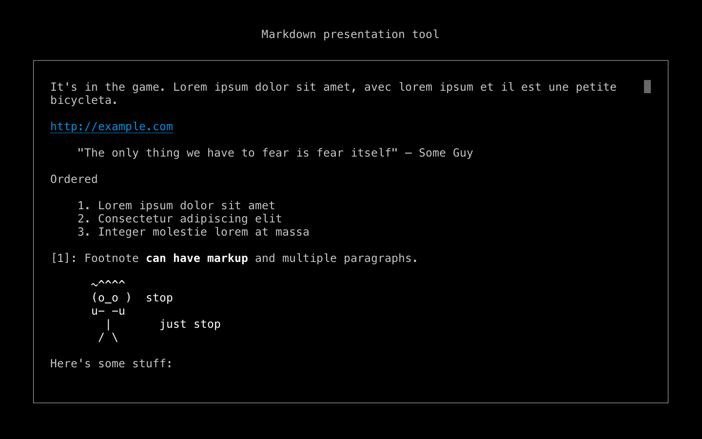
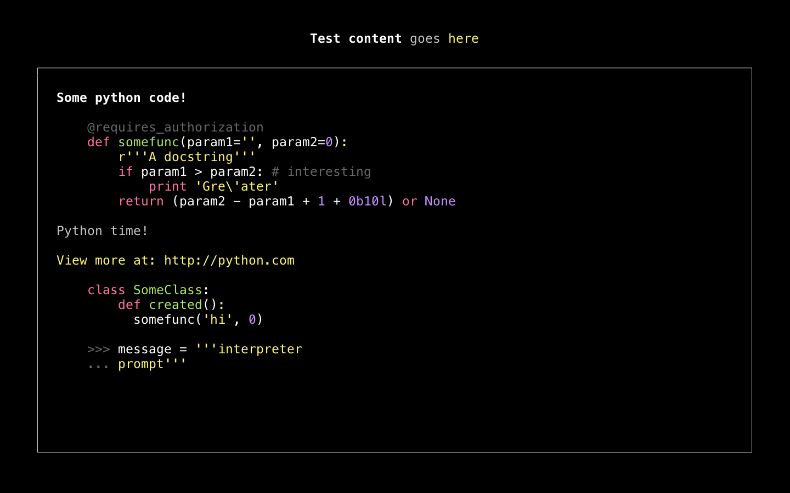

# MDV

A simple, styled command-line presentation tool using markdown, built with `blessed-vue`.




## Build Setup

```bash
npm install
npm run start sample.md
```

## Creating a Presentation

Normal Markdown rules apply, with the following exceptions:
- Pages are separated by `!!!` characters and slide titles can be provided by `!!!Example slide title.`
- Links will only show the href, to allow clicking through from the terminal.
- Common usage examples are illustrated in `sample.md`.

This project uses a slightly modified version of `marked-terminal` to facilitate syntax highlighting in multiple languages via `cli-highlight`. The theme is based loosely on the `monokai-sublime` theme.
